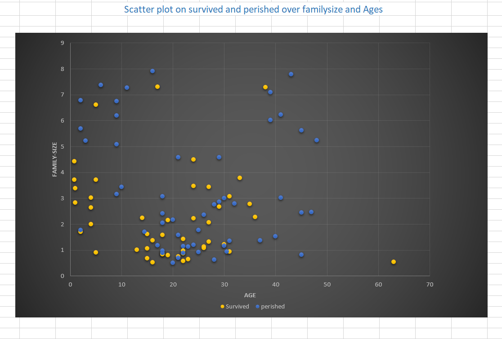
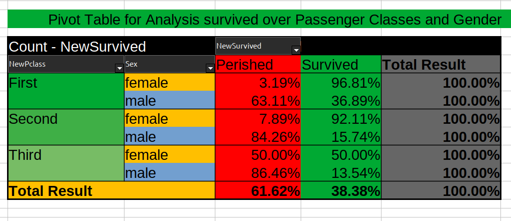

# Titanic Dataset Exploratory Data Analysis (EDA)

### Screen1

### Screen2

## Overview
This repository contains an Exploratory Data Analysis (EDA) of the Titanic dataset using Microsoft Excel. EDA is a critical step in data analysis, where we explore and summarize the main characteristics, patterns, and relationships in the data.

## Dataset
The Titanic dataset used in this analysis contains information about passengers on the ill-fated Titanic voyage, including details about their survival status, age, class, gender, and more. You can find the dataset in the `data` directory.

## Tools Used
To perform EDA on the Titanic dataset, we utilized various data analytics tools and techniques within Microsoft Excel:

- **Descriptive Analysis**: Descriptive statistics were used to summarize and understand the basic properties of the data, such as mean, median, mode, standard deviation, and more.

- **Pivot Table**: Pivot tables were employed to segment and summarize data for easy analysis. They allowed us to group data by categories such as passenger class, gender, and age, and then calculate relevant statistics.

- **Histogram**: Histograms were created to visualize the distribution of continuous variables, such as age. They help in understanding the data's central tendencies and spreads.

- **Bar Graph**: Bar graphs were used to represent categorical data, such as survival status, passenger class, and gender. They provide a clear visual representation of the data's distribution.

- **Scatter Plot**: Scatter plots helped us explore relationships between two continuous variables, such as age vs. fare. These plots are useful for identifying correlations and patterns.

- **Box Plot**: Box plots were created to visualize the spread and skewness of the data. They are particularly helpful in identifying outliers and understanding the variability in the data.

## Results
The EDA process allowed us to gain insights into the Titanic dataset and its passengers. Some of the key findings include:

- Distribution of passengers by class, gender, and age.
- Survival rate analysis by class and gender.
- Age distribution of passengers and its impact on survival.
- Fare distribution and its relationship with passenger class.
- Identification of outliers and extreme values.

## Usage
You can use this repository to:

1. Data Analytics
2. Download the dataset and perform your own analysis.
3. Contribute to the project by adding new analyses or visualizations.

## Dependencies
The analysis was conducted using Microsoft Excel. To reproduce the results or conduct further analysis, you will need a copy of Microsoft Excel or a compatible spreadsheet software.

## Repository Structure
- `data/`: Contains the Titanic dataset in CSV format.
- `notebooks/`: Includes the Excel workbook used for EDA.
- `images/`: Stores visualizations and graphs generated during the analysis.
- `LICENSE`: The license for this repository.

## License
This project is licensed under the [MIT License](LICENSE).

## Acknowledgments
Special thanks to the Kaggle community for providing the Titanic dataset and inspiring this analysis.
